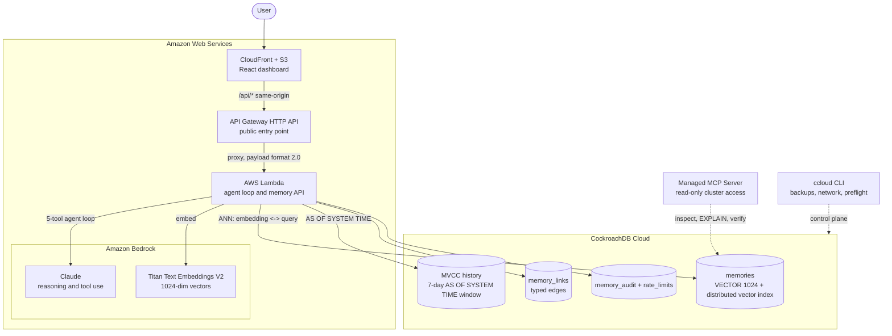

# Memora AI — persistent memory for AI agents

**CockroachDB × AWS Hackathon: Build the Future of Agentic Memory**

An agent forgets everything the moment a session ends. Memora gives it a memory that doesn't: every
fact it learns is embedded, stored in CockroachDB, and recalled by meaning — across sessions,
restarts, and model swaps.

The part we think is genuinely new: **you can ask the agent what it believed last Tuesday, and get a
truthful answer.** CockroachDB is an MVCC store, so superseded row versions are already on disk.
`AS OF SYSTEM TIME` reads a past belief state exactly — no history table, no snapshots, no extra
write cost. Every other memory layer we looked at can tell you what an agent knows. This one can tell
you what it *used to* know, and when that changed.

```
You:  What's our retention policy?
Agent: Ninety days, matching the compliance requirement.
You:  What did you think an hour ago?
Agent: Sixty days — that was raised after the audit. Before that I had thirty.
```

---

## Architecture



---

## CockroachDB tools we used, and what the agent does with them

The rules require at least two. We used all four.

### 1. Distributed Vector Indexing — the memory layer itself

`memories.embedding` is a `VECTOR(1024)` column carrying Titan Text Embeddings V2 output, indexed by
`memories_embedding_idx`. Every `recall_memory` tool call is an approximate-nearest-neighbour search
over that index.

Two decisions are load-bearing:

- **The index is prefixed by `(tenant_id, agent_id)`.** CockroachDB partitions the ANN search by the
  prefix, so one agent's recall never scans another tenant's vectors. Isolation and performance come
  from the same mechanism rather than a `WHERE` clause applied afterwards. Verified, not assumed —
  `EXPLAIN` shows `vector search … prefix spans: [/'tenant'/'agent' - …]`.
- **Every embedding is normalized to unit length before it is written.** CockroachDB only accelerates
  L2 distance (`<->`); cosine and inner product silently fall back to a full scan. On unit vectors,
  L2 ordering *is* cosine ordering — so we get cosine semantics at index speed. There is a test that
  fails if that property ever breaks.

A second index, `memories_shared_embedding_idx ON (tenant_id, shared, embedding)`, serves cross-agent
recall of shared memories without slowing normal per-agent recall.

### 2. MVCC time travel — `AS OF SYSTEM TIME`

The migration raises `gc.ttlseconds` on `memories` to 7 days, and three endpoints read history:
`/api/time-travel` (recall against a past state), `/api/belief-diff` (what was learned vs. changed
since a moment), and `/api/provenance` (walk a supersession chain with a recursive CTE). The agent
has a `recall_as_of` tool, so it can answer questions about its own past beliefs directly.

Time travel composes with the vector index, so historical recall is still an indexed ANN search.

**Security note worth reading:** CockroachDB rejects bound parameters after `AS OF SYSTEM TIME` — it
accepts only constant expressions, which forces string interpolation. `asOfClause()` in
[time-travel.ts](server/src/time-travel.ts) is the only barrier between caller input and query text,
so it is a strict allowlist of three shapes, and ten injection attempts are in the test suite.

### 3. CockroachDB Cloud Managed MCP Server

Configured in [.mcp.json](.mcp.json) against `https://cockroachlabs.cloud/mcp` in read-only mode. We
use it from Claude Code to inspect what the agent actually stored, run `EXPLAIN` to confirm the vector
index is used rather than scanned, and check recall latency against real data — without writing
throwaway admin scripts or opening a write path into production memory. Read-only is deliberate: a bad
generated query cannot corrupt the store, and every call lands in the Cloud audit log.

### 4. ccloud CLI + Agent Skills

[`scripts/ccloud-ops.sh`](scripts/ccloud-ops.sh) wraps the control plane for agent use — `status`,
`backups`, `backup-now`, `network`, `retention`, and a read-only `preflight` that runs every check
before a deploy. Every subcommand emits JSON, which is the point: an agent can call these and parse
the result instead of a human clicking through the Console.

Two Agent Skills encode the CockroachDB expertise this project accumulated, in the portable
`SKILL.md` format:

- [`memora-memory-schema`](.claude/skills/memora-memory-schema/SKILL.md) — the live-memory predicate,
  why only L2 is accelerated, how to get the index used, and a debugging ladder for wrong recall.
- [`cockroach-vector-ops`](.claude/skills/cockroach-vector-ops/SKILL.md) — verifying an index is
  actually used, reading `EXPLAIN` output, sizing the retention window, follower reads.

## AWS services we used, and how

- **Amazon Bedrock — Claude Sonnet 4.6.** Runs the agent loop with five memory tools and streaming,
  via the Global inference profile (`global.anthropic.claude-sonnet-4-6`) and classic
  `AnthropicBedrock`; see [agent.ts](server/src/agent.ts).
- **Amazon Bedrock — embeddings.** Every memory and query becomes a 1024-dimension vector that
  CockroachDB indexes. Two interchangeable models are supported at that exact width, **Amazon Titan
  Text Embeddings V2** and **Cohere Embed v3**, selected by `EMBEDDING_PROVIDER`. `auto` demotes
  Titan → Cohere → offline stand-in one step at a time, and records which model produced each vector
  so the two spaces are never compared (see *Embedding provenance* below).

  Cohere is used asymmetrically the way it is designed to be: a stored memory is embedded with
  `search_document` and a question with `search_query`. Embedding a query as a document measurably
  degrades retrieval, so the caller's intent is threaded all the way down rather than guessed.
- **AWS Lambda.** Hosts the agent loop and memory API. The connection pool is module-scoped so it
  survives across invocations — reconnecting per request would dominate response time and exhaust the
  cluster's connection limit.
- **Amazon S3 + CloudFront.** Serve the React dashboard.

---

## What makes this a memory layer, not a RAG index

| Behaviour | What it does | Why it matters |
|---|---|---|
| **Three memory types** | `episodic` (what happened), `semantic` (durable facts), `procedural` (how-to) | The agent picks the kind when saving and filters by it when recalling |
| **Write-time deduplication** | A near-identical memory reinforces the existing row instead of inserting | Without it, hearing the same preference ten times leaves ten rows and recall degrades into repetition |
| **Supersession, not deletion** | Corrections set `superseded_by` and write a `supersedes` edge | You can answer "what did it believe last week, and when did that change?" |
| **Consolidation** | Clusters related episodes and distills them into one semantic fact via Claude, linked by `derived_from` edges | Human memory generalizes episodes during sleep; without it the store only grows |
| **Decay** | Importance falls with time since last access, damped by recall count; semantic decays at a third the rate of episodic | A fact recalled fifty times should outlive one never recalled |
| **Archival is reversible** | Decayed memories leave recall but stay queryable and can be reinstated | Deletion would make the forgetting curve destructive |
| **Ranked recall** | Similarity 70%, importance 20%, recency 10% with a 30-day half-life | Similarity dominates on purpose — a relevant old memory should beat a fresh irrelevant one |
| **Cross-agent sharing** | Memories flagged `shared` are recallable by every agent in the tenant | One agent's discovery becomes available to the fleet |
| **Full audit trail** | Every read and write lands in `memory_audit` with latency | Answers "why did the agent say that?" after the fact |

## Running without a model at all

Our Bedrock account has a zero on-demand quota on every chat model, in every region — a new-account
restriction, not a configuration mistake. Rather than let that take the product down, the memory
layer runs on its own, and the deployed demo is currently serving this path.

That is the point worth reading: **none of what makes this a memory needs an LLM.** Embedding,
vector recall, deduplication, classification, supersession and time travel are all database work.
Only the conversational wrapper is Claude's.

So when Bedrock is unavailable the agent keeps its behaviour and drops only the reasoning:

- **Statements are still classified.** `heuristics.ts` decides `episodic` / `semantic` /
  `procedural` from shallow language rules, and sets importance from them. Filing everything as
  `semantic` would have been easier and would have quietly deleted memory types from the demo.
- **Corrections still supersede.** "actually, retention is ninety days now" finds the nearest
  existing memory, marks it superseded, and writes a `supersedes` edge — so the knowledge graph and
  `AS OF SYSTEM TIME` still have something real to show.
- **Writes still refuse when they cannot be honest.** If embeddings are unavailable, storing a
  memory would put a row in the table that vector recall could never retrieve, so it declines and
  says why instead.
- **Every such reply is labelled** "memory layer only — not model output", in the API payload and in
  the dashboard. Nothing pretends to be reasoning.

Two failure modes this had to solve, both of which made the deployment feel broken rather than
degraded:

- A throttled Bedrock call was retried with exponential backoff, so a single message took **134
  seconds** before the fallback even started — longer than Lambda's timeout, so the request simply
  died. The SDK is now capped at one retry, and a circuit breaker skips Bedrock entirely for 60
  seconds after a failure. The same seven-turn script went from **15m42s to 8.2s**.
- The heuristics are covered by tests, because a regression there would leave the demo *looking*
  fine while silently losing memory types and supersession.

## Production readiness

- **Tenant isolation** is derived from the API key, never from the request body — a caller cannot read
  another tenant's memories by guessing an id. There is a test for that.
- **Serializable retries.** CockroachDB runs `SERIALIZABLE`; a losing transaction aborts with SQLSTATE
  `40001` and is *expected* to be retried. `withTransaction()` retries with exponential backoff and
  jitter.
- **Rate limiting lives in the database, not in memory.** An in-process limiter grants the full quota
  independently in every Lambda execution environment — with N warm instances the real limit becomes
  N× the configured one. A fixed-window counter in CockroachDB is shared by every instance. It fails
  open: a limiter that takes the API down when its counter is unavailable has turned throttling into
  an outage.
- **Metrics** at `/api/metrics` with p50/p95/p99 and error rate per operation.
- **Graceful degradation.** The dashboard shows "API unreachable" with the exact fix rather than fake
  numbers; consolidation falls back to a representative memory if Bedrock is unavailable; the health
  check runs a real query so it fails when the database is unreachable, not just when the process is.
- **122 tests**; 39 of them need no database and no AWS account at all.

---

## Running it

You need a CockroachDB cluster and (for the real agent) AWS Bedrock access.
**[SETUP.md](SETUP.md) walks through the signups** — do that first, since Bedrock model access can
take time to approve.

### Without any cloud account

The whole memory layer runs locally. Embeddings fall back to a deterministic offline provider, so the
schema, vector index, time travel, consolidation and decay are all exercisable with no credentials:

```bash
# 1. A local CockroachDB (v25.2+ for vector indexing)
cockroach start-single-node --insecure --listen-addr=localhost:26257
cockroach sql --insecure -e 'CREATE DATABASE memora_dev'

# 2. Backend
cd server && npm install
cp .env.example .env    # set DATABASE_URL to the local cluster, EMBEDDING_PROVIDER=local
npm run db:migrate      # schema, vector indexes, 7-day retention window
npm run db:seed         # a realistic memory store to explore
npm run dev             # API on http://localhost:8787

# 3. Frontend, from the repo root in a second terminal
npm install && npm run dev
```

`EMBEDDING_PROVIDER=local` is a hashed bag-of-words stand-in, **not** a semantic embedder — it
captures lexical overlap only. It exists so tests and local development need no credentials. Set
`EMBEDDING_PROVIDER=bedrock` for anything real.

### With CockroachDB Cloud and Bedrock

Same steps, with `DATABASE_URL` pointing at your cluster and `EMBEDDING_PROVIDER=bedrock`. Then:

```bash
cd server && npm run verify
```

That embeds a sentence through Bedrock, writes it to CockroachDB, reads it back by semantic search,
and prints latency at each step — so a failure points at exactly one thing rather than "something is
misconfigured".

### Tests

```bash
cd server && npm test
```

122 tests against a real CockroachDB (an in-memory fake would exercise none of the vector index, MVCC,
or serializable behaviour that matters here). They skip cleanly with a message if no cluster is
reachable.

### Deploying

```bash
cd server && ./deploy.sh
```

See [DEPLOY.md](DEPLOY.md).

---

## API

| Method | Path | Purpose |
|---|---|---|
| `GET` | `/api/health` | Liveness; runs a real query against CockroachDB |
| `GET` | `/api/metrics` | p50/p95/p99 latency and error rate per operation |
| `POST` | `/api/chat` | One agent turn; returns the reply plus what it recalled and saved |
| `POST` | `/api/chat/stream` | The same turn as server-sent events, with tool calls announced |
| `GET` | `/api/memories` | Recent live memories |
| `POST` | `/api/memories` | Write a memory directly, bypassing the agent |
| `POST` | `/api/memories/correct` | Supersede a memory with a correction |
| `POST` | `/api/memories/reinstate` | Bring an archived memory back |
| `GET` | `/api/search?q=` | Semantic search over the vector index |
| `GET` | `/api/time-travel?q=&at=` | Recall against a past database state |
| `GET` | `/api/belief-diff?q=&at=` | What was learned vs. changed since a moment |
| `GET` | `/api/provenance?memoryId=` | Walk a belief's revision chain |
| `GET` | `/api/retention` | How far back time travel can actually reach |
| `POST` | `/api/consolidate` | Distill episode clusters into durable facts |
| `POST` | `/api/decay` | Apply the forgetting curve |
| `GET` | `/api/graph` | Nodes and typed edges for the knowledge graph |
| `GET` | `/api/stats` | Counts by kind, plus average recall latency |
| `GET` | `/api/audit` | Recent reads and writes |

Set `MEMORA_API_KEYS` as `key:tenant` pairs to enable auth; unset, everything runs as the `demo`
tenant for local development.

## Repository layout

| Path | What's in it |
|---|---|
| [server/src/schema.sql](server/src/schema.sql) | Memory schema, vector indexes, retention window, graph edges, audit, rate limits |
| [server/src/memory.ts](server/src/memory.ts) | Recall, write, dedup, supersession, ranking, graph |
| [server/src/time-travel.ts](server/src/time-travel.ts) | `AS OF SYSTEM TIME` recall, belief diff, provenance, the timestamp allowlist |
| [server/src/consolidation.ts](server/src/consolidation.ts) | Clustering, distillation, decay, reinstatement |
| [server/src/agent.ts](server/src/agent.ts) | Claude tool-use loop, streaming and buffered |
| [server/src/embeddings.ts](server/src/embeddings.ts) | Titan embeddings, the local provider, unit-vector normalization |
| [server/src/observability.ts](server/src/observability.ts) | Latency metrics and the distributed rate limiter |
| [server/src/db.ts](server/src/db.ts) | Pool and serializable-retry transaction wrapper |
| [server/test/](server/test/) | 122 tests |
| [src/pages/DashboardPage.tsx](src/pages/DashboardPage.tsx) | Chat, memory browser, knowledge graph, time travel |
| [src/components/KnowledgeGraph.tsx](src/components/KnowledgeGraph.tsx) | Force-directed graph over real memory links |
| [.claude/skills/](.claude/skills/) | CockroachDB Agent Skills |
| [scripts/ccloud-ops.sh](scripts/ccloud-ops.sh) | ccloud control-plane operations |

## Prior work disclosure

Per the hackathon's new-projects rule: the marketing pages and visual design were scaffolded with
[Bolt](https://bolt.new) at the start of the submission period (first commit August 4, 2026). The
memory layer, agent, schema, API, time travel, consolidation, tests, Agent Skills, and all CockroachDB
and AWS integration were written during the submission period for this hackathon.

## License

MIT — see [LICENSE](LICENSE).
